### CI/CD — Это набор принципов и практик, которые позволяют чаще и надежнее развертывать изменения программного обеспечения.
Причины применения CI/CD:

Командная разработка;
Длинный жизненный цикл ПО;
Сокращение релизного цикла;
Сложность развертывания и тестирования крупных систем;
Человеческий фактор.

CI/CD pipeline - Это последовательность действий (скриптов) для определенной версии кода в репозитории, которая запускается автоматически при совершении изменений.

CI (Continuous Integration) — в дословном переводе «непрерывная интеграция».
Имеется в виду интеграция отдельных кусочков кода приложения между собой.


### Подключение к виртуалке
- На виртуалке прописываем ip addr show, в терминале ssh loris@айпишник


## Part 1. Настройка *gitlab-runner*

### Установка виртуальной машины
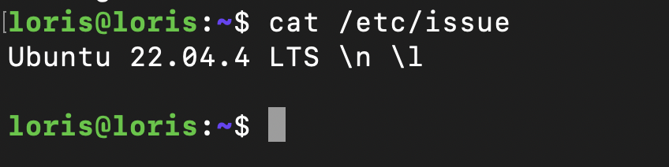

### Установка gitlab-runner

``` 
curl -L https://packages.gitlab.com/install/repositories/runner/gitlab-ci-multi-runner/script.deb.sh | sudo bash
```


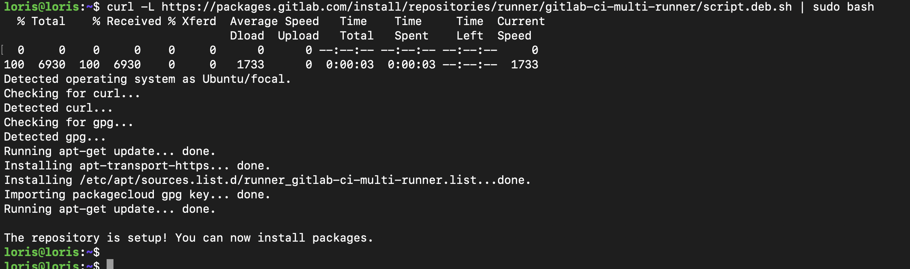

```
lsudo apt install gitlab-runner
```

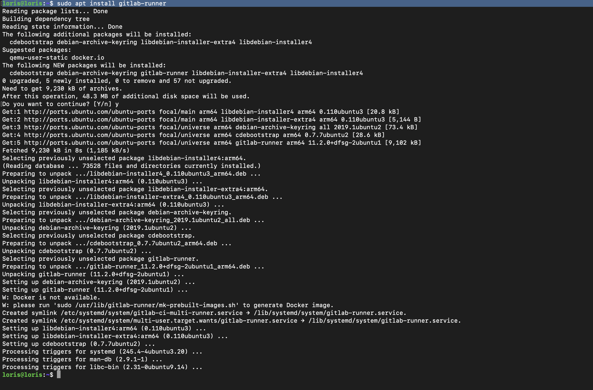

### Регистрация gitlab-runner

``` brew
sudo gitlab-runner start
sudo gitlab-runner register
```
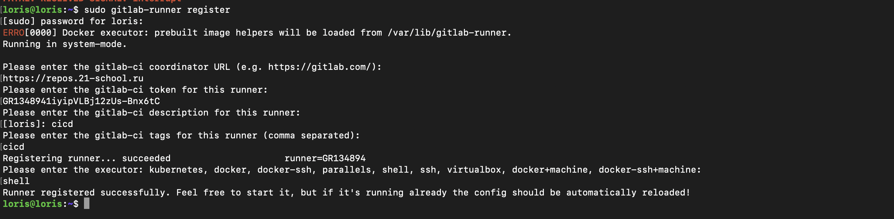


## Part 2. Сборка

Напишем этап для CI по сборке приложений из проекта `C2_SimpleBashUtils`
Создадим файл `.gitlab-ci.yml` и добавим этап запуска сборки через `Makefile`:

- yml. Это файл в корневом каталоге проекта Git, в котором записан ряд этапов и правил выполнения. GitLab-CI проанализирует его после пуша и вызовет Gitlab-runner(а) для запуска в соответствии с его

```
stages:
  - build

build-job:
  stage: build
  script:
    - cd src/cat
    - make
    - cd ../../
    - cd src/grep
    - make
    - cd ../../
  artifacts:
    paths:
      - src/cat/s21_cat
      - src/grep/s21_grep
    expire_in: 30 days

```

После того как мы запушим изменения, в разделе `CI/CD -> Pipelines` появится информация о результате:
   
   - В случае ошибки
    


    - В случае успеха:


### Джоб **build** успешно пройден с сохранением артефактов


## Part 3. Тест кодстайла

### Обновление конфигурации
```yml
stages:
  - build
  - style

build-job:
  stage: build
  script:
    - cd src/cat && make && cd ../../
    - cd src/grep && make && cd ../../
  artifacts:
    paths:
      - src/cat/s21_cat
      - src/grep/s21_grep
    expire_in: 30 days

style-job:
  stage: style
  script:
    - cd src && make clang
    - cat ./style_test_result.txt
    - bash ./check_styles.sh
    - rm -rf ./style_test_result.txt
  allow_failure: false
```

### Цель в мейкфайле
```makefile
clang:
	$(CLANG_COPY) && clang-format $(CLANG_MODE) $(PATHS) 2> style_test_result.txt && $(CLANG_REMOVE)
```

### Скрипт для проверки стилей
```bash
#!/bin/bash

if [ -s ./style_test_result.txt ]; then
    exit 1
fi

exit 0
```


### Пройденная джоба **style** с пройденным тестом линтера


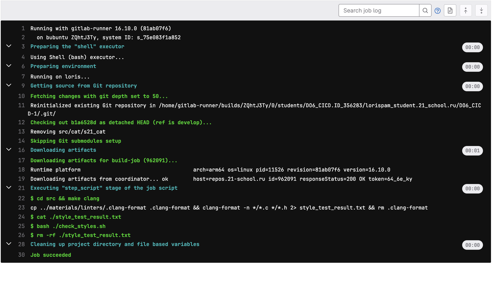

## Part 4. Интеграционные тесты


### Обновление конфигурации
```ym
stages:
  - build
  - style
  - tests

build-job:
  stage: build
  script:
    - cd src/cat && make && cd ../../
    - cd src/grep && make && cd ../../
  artifacts:
    paths:
      - src/cat/s21_cat
      - src/grep/s21_grep
    expire_in: 30 days

style-job:
  stage: style
  script:
    - cd src && make clang
    - cat ./style_test_result.txt
    - bash ./check_styles.sh
    - rm -rf ./style_test_result.txt
  allow_failure: false

tests-job:
  stage: tests
  script:
  - cd src/cat/ && make
  - bash ./tests.sh && cd ../../
  - cd src/grep/ && make
  - bash ./tests.sh && cd ../../
  - cd src
  - bash ./check_tests.sh
  - rm -rf ./test_result.txt

  allow_failure: false
```

### Пройденная джоба **test** 


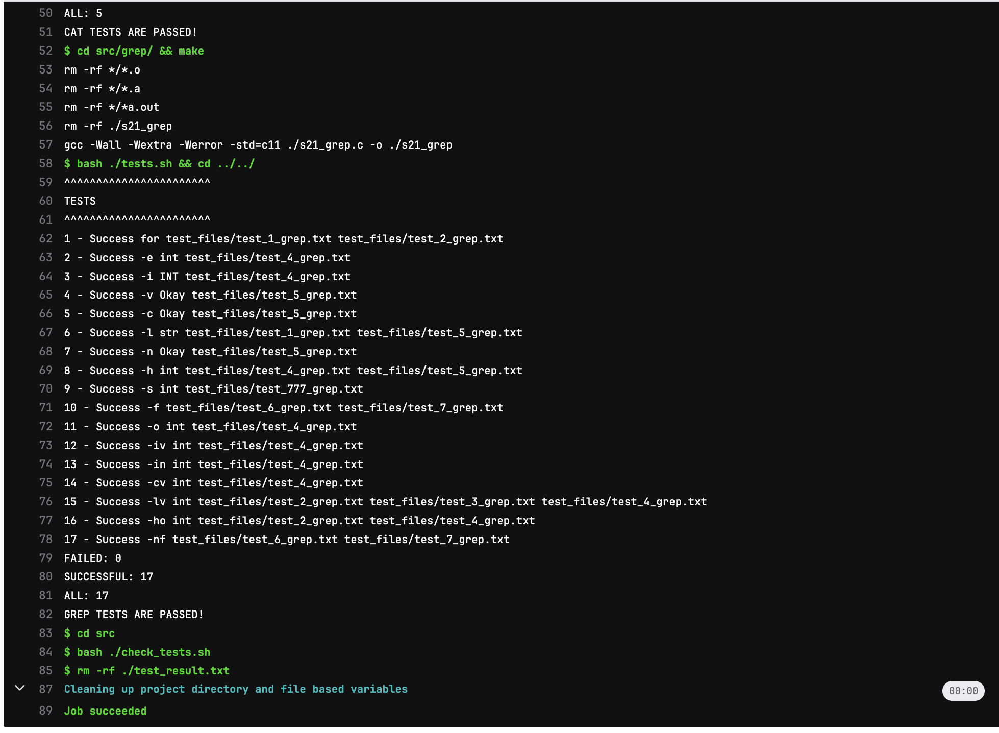

## Part 5. Этап деплоя


Поднимем вторую виртуальную машину Ubuntu Server 20.04 LTS

* Каждый раз запуская скрипт нам требуется доступ к папкам на удаленном сервере. Все работы выполняет gitlab-runne. Необходимо на сервере где запущен gitlab-runner сменить пользователя на gitlab-runner командой su - gitlab-runner, далее сгенерировать ssh ключ и внести в файл /.ssh/authorized_keys на удаленном сервере командой ssh-copy-id loris@192.168.64.14 и если возникает ошибка доступа при переноса файлов, нужно делать пользователя, под которым заходишь на вторую машину владельцем директории в которую переносишь файлы sudo chown -R $(name) .

* Добавили на вторую машину ssh ключ`

* Пингуем их друг с другом чтобы проверить соединение 

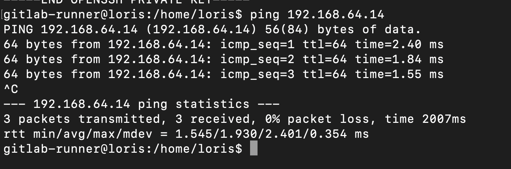

### Обновление конфигурации

```yml
stages:
  - build
  - style
  - tests
  - deploy

build-job:
  stage: build
  script:
    - cd src/cat && make && cd ../../
    - cd src/grep && make && cd ../../
  artifacts:
    paths:
      - src/cat/s21_cat
      - src/grep/s21_grep
    expire_in: 30 days

style-job:
  stage: style
  script:
    - cd src && make clang
    - cat ./style_test_result.txt
    - bash ./check_styles.sh
    - rm -rf ./style_test_result.txt
  allow_failure: false

tests-job:
  stage: tests
  script:
  - cd src/cat/ && make
  - bash ./tests.sh && cd ../../
  - cd src/grep/ && make
  - bash ./tests.sh && cd ../../
  - cd src
  - bash ./check_tests.sh
  - rm -rf ./test_result.txt
  allow_failure: false

deploy-job:
  stage: deploy
  when: manual
  script:
    - cd src
    - bash ./deploy.sh
  allow_failure: false
```
##### Написать bash-скрипт, который при помощи **ssh** и **scp** копирует файлы, полученные после сборки (артефакты), в директорию */usr/local/bin* второй виртуальной машины

```bash

#!/bin/bash
echo 'Deploy...'
scp -P 22 ./cat/s21_cat loris@192.168.64.14:~/
scp -P 22 ./grep/s21_grep loris@192.168.64.14:~/

ssh loris@192.168.64.14 "echo '0000' | sudo -S mv ~/s21_cat ~/s21_grep /usr/local/bin"
echo 'Done'

```

##### Сохранить дампы образов виртуальных машин


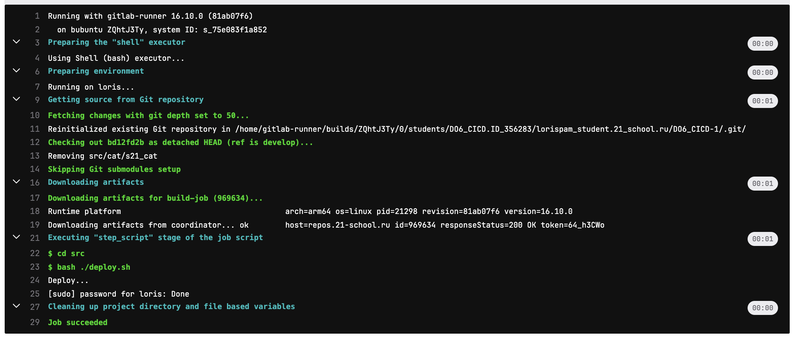


* Проверим что файлы успешно скопировались:

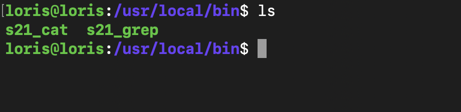

## Part 6. Дополнительно. Уведомления

Настрой уведомления о успешном/неуспешном выполнении пайплайна через бота с именем «[твой nickname] DO6 CI/CD» в Telegram.

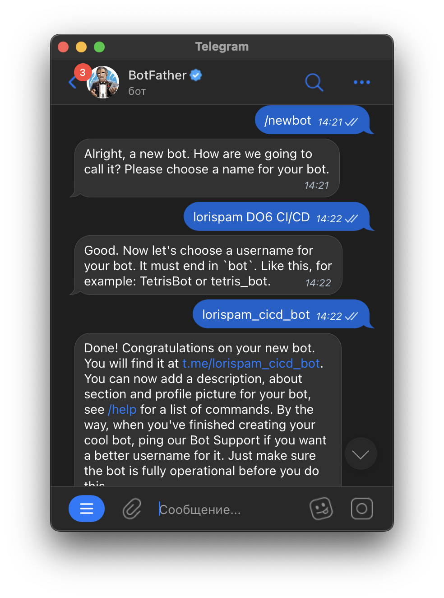


* Скрипт для уведомлений о успешном/неуспешном выполнении пайплайна:
```bash

#!/bin/bash
# уже нет такого токена)
API_TOKEN="7149887935:AAEDHytI1aa-N_b_A0suyJslIOj9sBA1roI"
CHAT_ID="123456789"
URL="https://api.telegram.org/bot$API_TOKEN/sendMessage"
TEXT="FROM:+$CI_COMMIT_AUTHOR%0A%0AJOB: $CI_JOB_NAME%0A%0ASTATUS:+$CI_JOB_STATUS%0A%0APROJECT:+$CI_PROJECT_NAME"

curl -s -d "chat_id=$CHAT_ID&disable_web_page_preview=1&text=$TEXT" $URL 

```
- Меняем ямл:
- after_script:
    - cd src && bash ./message.sh


- Проверяем:
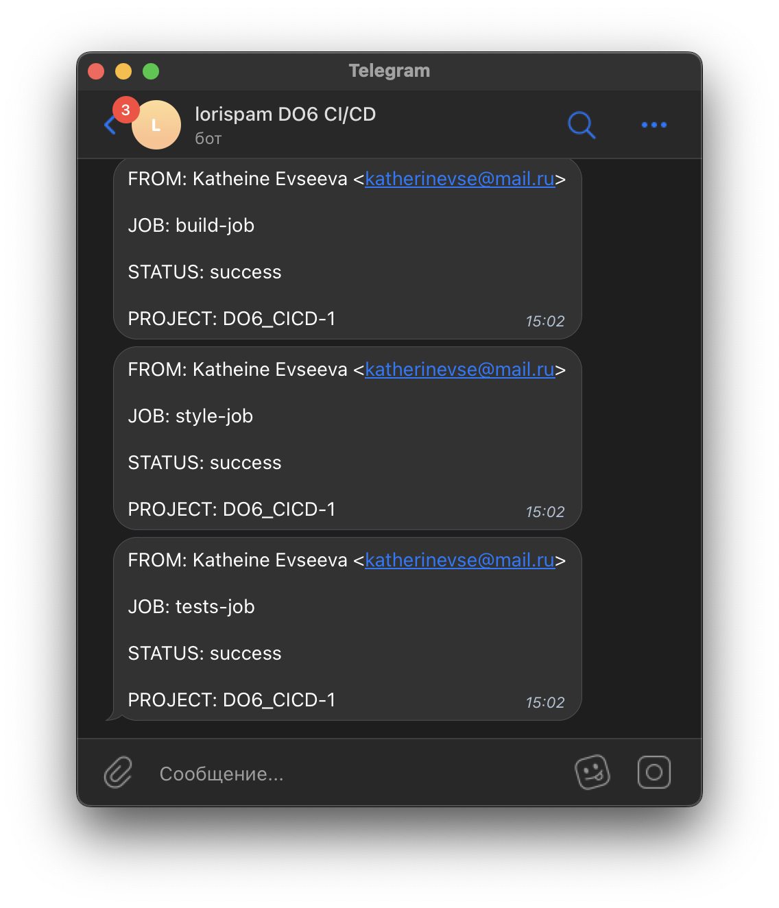

